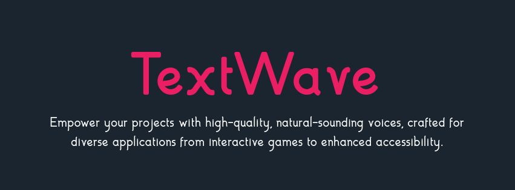

## 🌊 TextWave

TextWave is your one-stop solution for transforming text into natural-sounding speech. With its support for diverse languages, accents, and customizable settings, you can unlock a world of possibilities. From crafting immersive games and enhancing accessibility to exploring new frontiers in creative expression, TextWave empowers you to bring your ideas to life through the magic of voice.

### ✨ Key Features

- **Text to Speech Magic:** Effortlessly convert written text into high-quality, lifelike speech.
- **Multilingual Mastery:** Break down language barriers with support for a wide range of languages and accents.
- **Tone & Style Customization:** Fine-tune your voice output to match the desired emotion and context.

### 🚀 Getting Started with TextWave

Before you use TextWave, ensure you have the following prerequisites:

* **Git:** For cloning the TextWave repository. [https://git-scm.com/](https://git-scm.com/)
* **Python 3.8+:** The programming language powering TextWave. [https://www.python.org/](https://www.python.org/)
* **Redis:** An in-memory data store used for rate limiting. [https://redis.io/](https://redis.io/)
* **MySQL:** A relational database for storing project-related data. [https://www.mysql.com/](https://www.mysql.com/)
* **FFmpeg:**  A powerful, open-source multimedia framework used to record, convert, and stream audio and video files. [https://ffmpeg.org/download.html](https://ffmpeg.org/download.html)
  
Now, let's get TextWave up and running:

#### 1. Clone the Repository

Open your terminal or command prompt and execute the following command to download the TextWave source code:

```bash
git clone https://github.com/Afnanksalal/TextWave.git
```

#### 2. Set Up the Backend (Flask)

Navigate to the backend directory:

```bash
cd textwave/backend
```

* **Environment Variables:** Create a `.env` file in this directory and populate it with your Redis configuration details:

   ```
   REDIS_HOST=localhost
   REDIS_PORT=6379
   REDIS_PASSWORD=your_redis_password
   REDIS_SSL=True
   ```

* **Install Dependencies:**  Use pip to install the necessary Python packages:

   ```bash
   pip install -r requirements.txt
   ```

   **Important:** During the installation, if you encounter any errors related to `unidic`, install it separately using:

   ```bash
   python -m unidic download
   ``` 
* **Download OpenVoice Checkpoint:**  
   - Download the checkpoint file from: [https://myshell-public-repo-hosting.s3.amazonaws.com/openvoice/checkpoints_v2_0417.zip](https://myshell-public-repo-hosting.s3.amazonaws.com/openvoice/checkpoints_v2_0417.zip)
   - Extract the contents and place the `checkpoint` directory in the root of your `backend` folder.

* **Launch the Backend:**

   ```bash
   python app.py
   ```

   By default, your Flask app will usually start on `http://127.0.0.1:5000/`. Note this URL, as you'll need it for the frontend.

#### 3. Configure the Frontend (Django)

Change directories to the frontend:

```bash
cd ../frontend 
```

* **Install Required Packages:**
   ```bash
   pip install django django-cors-headers mysqlclient 
   ```
* **Database Settings:** Open the `settings.py` file.  Within the `DATABASES` dictionary, update the settings for the 'default' connection to match your MySQL credentials:

   ```python
   DATABASES = {
       'default': {
           'ENGINE': 'django.db.backends.mysql',
           'NAME': 'your_database_name',
           'USER': 'your_database_user',
           'PASSWORD': 'your_database_password',
           'HOST': 'your_database_host', 
           'PORT': '3306', 
       }
   }
   ```

* **Connect to the Backend:** In the `flask_api.py` file, replace  `'http://your_backend_url'` with the actual URL of your running Flask backend (e.g., `http://127.0.0.1:5000/`).


* **Run Database Migrations:**

   ```bash
   python manage.py makemigrations
   python manage.py migrate
   ```

* **Start the Development Server:**

   ```bash
   python manage.py runserver
   ```

   Your Django development server will typically run on `http://127.0.0.1:8000/`.


## 🗒️ License

This project is licensed under the MIT License. See the [LICENSE](LICENSE) file for more information.

## 📝 Acknowledgements

TextWave leverages the power of several open-source libraries and projects. We'd like to extend our gratitude to the developers and communities behind these fantastic tools:

**Backend:**

* **Flask:**  A lightweight and flexible web framework for Python. [https://flask.palletsprojects.com/](https://flask.palletsprojects.com/)
* **Librosa:** For audio analysis and feature extraction. [https://librosa.org/](https://librosa.org/)
* **NumPy:** The fundamental package for scientific computing with Python. [https://numpy.org/](https://numpy.org/)
* **Redis:**  An open-source, in-memory data structure store. [https://redis.io/](https://redis.io/)
* **SoundFile:** For reading and writing audio files. [https://pysoundfile.readthedocs.io/en/latest/](https://pysoundfile.readthedocs.io/en/latest/)
* **PyTorch:** An open-source machine learning framework. [https://pytorch.org/](https://pytorch.org/)
* **Transformers:** Provides pre-trained models for Natural Language Processing tasks. [https://huggingface.co/transformers/](https://huggingface.co/transformers/)
* **python-dotenv:** Loads environment variables from `.env` files. [https://github.com/theskia/python-dotenv](https://github.com/theskia/python-dotenv)
* **SentencePiece:** For subword tokenization. [https://github.com/google/sentencepiece](https://github.com/google/sentencepiece)
* **SacreMoses:** Provides tools for text processing in NLP. [https://github.com/alvations/sacremoses](https://github.com/alvations/sacremoses)
* **MeloTTS:** A multi-speaker English text-to-speech model. [https://github.com/myshell-ai/MeloTTS](https://github.com/myshell-ai/MeloTTS) 
* **MyShell-OpenVoice:** An open-source text-to-speech voice for research. [https://github.com/myshell-ai/OpenVoice](https://github.com/myshell-ai/OpenVoice) 

**Frontend:**

* **Django:** A high-level Python web framework. [https://www.djangoproject.com/](https://www.djangoproject.com/)
* **django-cors-headers:**  A Django app that adds CORS (Cross-Origin Resource Sharing) headers to responses. [https://github.com/adamchainz/django-cors-headers](https://github.com/adamchainz/django-cors-headers)
* **mysqlclient:** A Python interface for accessing MySQL databases. [https://github.com/PyMySQL/mysqlclient-python](https://github.com/PyMySQL/mysqlclient-python)


### 🫶 Attribution

When using this project, please attribute the original author as follows:

```text
This project includes code from [TextWave](https://github.com/Afnanksalal/TextWave/) by Afnan, licensed under the MIT License.
```
